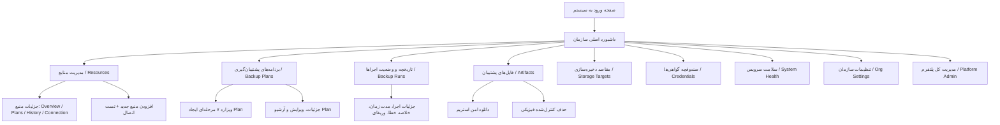

# UX & Information Architecture Specification
## Phase F0 — Frontend Architecture & UX Design Freeze

**Status**: F0 REVIEW CANDIDATE — Awaiting External Approval
**Target Repository Directory**: `/web`
**Baseline Git Commit**: `59d90ae074385ba27e1f14f00f886af6803a76b3`
**Companion Documents**:
* [./FRONTEND_ARCHITECTURE.md](./FRONTEND_ARCHITECTURE.md)
* [./DESIGN_SYSTEM.md](./DESIGN_SYSTEM.md)
* [./API_PAGE_MATRIX.md](./API_PAGE_MATRIX.md)

---

## ۱. هدف محصول و جهت‌گیری بصری و تعاملی (Product Goal & Interaction Direction)

پلتفرم مدیریت پشتیبان‌گیری (`Backup Platform`) به عنوان یک کنترل‌پنل زیرساختی مدرن برای ۴ گروه مخاطب طراحی شده است:
1. **مدیر ارشد پلتفرم (`Platform Admin / Operator`)**: نظارت بر سلامت کلی سیستم و ایجاد سازمان‌های جدید (`is_system_admin = true`).
2. **مدیران سازمان‌ها (`Organization Admins`)**: پیکربندی سرورها، کانکتورها، کردانشال‌ها، مقاصد ذخیره‌سازی، تعریف برنامه‌های زمان‌بندی، حذف و مدیریت کامل.
3. **کارشناسان عملیات (`Organization Members`)**: رصد مستمر وضعیت سلامت، اجرای دستی بکاپ‌های تاییدشده، اعتبارسنجی آنلاین و دانلود فایل‌های پشتیبان.
4. **ناظران (`View-only Users / Viewers`)**: پایش صرفاً خواندنی وضعیت سرورها، برنامه‌های پشتیبان‌گیری، مقاصد ذخیره‌سازی، تاریخچه اجراها و آرتیفکت‌های سازمانی مجاز بدون امکان اجرای بکاپ، دانلود، تغییر تنظیمات یا دسترسی به لاگ‌های حسابرسی (Audit Logs).

### حس و جهت‌گیری طراحی (Design Philosophy & Aesthetic Direction):
محصول باید حس یک ابزار زیرساختی ابری پیشرفته، حرفه‌ای و قابل اعتماد را منتقل کند و از قالب‌های رایگان یا تجاری بی‌کیفیت متمایز باشد:
* **پاکیزگی و مینیمالیسم در سطح Vercel**: فاصله‌گذاری‌های دقیق، تایپوگرافی خوانا، کنتراست متعادل و فقدان شلوغی بصری.
* **وضوح و شفافیت زیرساختی در سطح Cloudflare**: ارائه دقیق وضعیت شبکه‌ها، سرورها، پورت‌ها و شاخص‌های اتصال بدون ابهام.
* **ظرافت و پویایی تعاملی در سطح Linear**: ترنزیشن‌های نرم و سریع، بازخورد فوری در کیبورد و کلیک‌ها، استیت‌های در حال بارگذاری اسکلتی (Skeletons).
* **سلسله‌مراتب داده در سطح Stripe**: دسته‌بندی بصری منظم اطلاعات، برجسته‌سازی داده‌های اصلی و انتقال جزئیات فنی به لایه‌های ثانویه.
* **رویکرد دسترس‌پذیر در سطح DigitalOcean**: ساده‌سازی تنظیمات پیچیده سرور لینوکس و پایگاه داده برای کاربران کمتر متخصص بدون فدا کردن قدرت عملیاتی.

> [!NOTE]
> هیچ‌گونه لوگو، تایپوگرافی یا دارایی تجاری از سرویس‌های فوق کپی نمی‌شود؛ این موارد صرفاً به عنوان محک کیفی و راهنمای استانداردهای محصول مطرح هستند.

---

## ۲. اصل بنیادین تجربه کاربری: زبان انسانی مقدم بر شناسه‌های فنی (Core UX Principle)

یکی از نقایص کنترل‌پنل‌های سنتی زیرساخت، مواجه کردن مستقیم کاربر با شناسه‌های غیرقابل درک دیتابیس است. سیستم در تمامی صفحات، مفهوم تجاری و انسانی را در اولویت اول قرار می‌دهد:

```text
❌ رویکرد ضعیف سنتی:
Job d3eebc99-9c0b... | Engine: direct_stream | Target: 7a1eeb... | State: 2 | Code: 0

✅ رویکرد استاندارد پلتفرم:
Production Database (Ubuntu SSH)
Backup successful • Today at 02:00 (Duration: 2m 30s)
Stored in Primary AWS S3 (Bucket: prod-backups) • Verified • 1.4 GB
File: production_db.sql.gz
```

### استانداردهای نمایش داده‌ها:
* **شناسه‌های فنی (UUID, JobID, RunID, EngineType, StorageTargetID)**:
  * در نگاه اول پنهان هستند یا با فونت مونو کوچک همراه با آیکون «کپی شناسه» در بخش‌های فرعی قرار می‌گیرند.
  * در بخش‌های عیب‌یابی پیشرفته (`Advanced Details / Troubleshooting Drawer`) به صورت کامل برای مهندسان دواپس در دسترس هستند.
* **زمان‌ها و تاریخ‌ها**:
  * به صورت نسبی همراه با ساعت دقیق نمایش داده می‌شوند: `Today at 02:00` یا `2 hours ago`.
  * با هاور ماوس بر روی زمان، تاریخ دقیق با منطقه زمانی محلی و UTC در قالب Tooltip نمایش داده می‌شود.
* **نام‌گذاری فایل‌های آرتیفکت (`Artifact Filenames`)**:
  * در فاز F1 نام فایل دانلودی و نمایشی منحصراً از فیلد رسمی `artifact_name` برگرفته از بک‌اند (مانند `production_db.sql.gz` یا `public_html.tar.gz`) تامین می‌شود و تاریخ/زمان ایجاد (`created_at`) به عنوان یک ستون مجزا نمایش می‌یابد.
* **حجم داده‌ها**:
  * تبدیل خودکار بایت‌ها به واحدهای خوانا: `104857600 Bytes` ➔ `100 MB`، `1.4 GB`.
* **وضعیت‌ها**:
  * استفاده هم‌زمان از آیکون استاندارد، برچسب متنی واضح و رنگ مفهومی برای رعایت دسترسی‌پذیری.

---

## ۳. شل اصلی اپلیکیشن و ساختار واکنش‌گرا (Application Shell & Responsive Layout)

اپلیکیشن در دو حالت دسکتاپ و موبایل/تبلت ساختاردهی شده است:

```text
+-----------------------------------------------------------------------------------+
|  [Logo] Platform  | [Org Switcher: Acme Corp ▼]     [Health: OK] [User Menu: JD ▼]|
+-----------------------------------------------------------------------------------+
| Sidebar (Collapsible)  | Breadcrumbs: Dashboard > Resources > Database Prod       |
| ---------------------- | -------------------------------------------------------- |
| [icon] Dashboard       | Page Title: Database Prod (Ubuntu SSH)                   |
|                        |                                                          |
| BACKUP                 | [Tab: Overview] [Tab: Plans] [Tab: History] [Connection] |
| [icon] Resources (3)   | -------------------------------------------------------- |
| [icon] Backup Plans (5)| [KPI Card]          [KPI Card]          [KPI Card]       |
| [icon] Backup Runs     | Status: Active      Last Run: Success   Storage: S3 Prod |
| [icon] Artifacts       |                                                          |
| [icon] Storage Targets | Main Data Table / Content Area                           |
|                        | ...                                                      |
| MANAGEMENT             |                                                          |
| [icon] Credentials     |                                                          |
| [icon] Audit Logs*     |                                                          |
|                        |                                                          |
| SYSTEM                 |                                                          |
| [icon] Settings        |                                                          |
| [icon] System Health   |                                                          |
+-----------------------------------------------------------------------------------+
```

### اجزای شل در دسکتاپ (Desktop Shell):
1. **هدر سراسری (Top Header - ارتفاع ۶۴ پیکسل)**:
   * نشان تجاری پلتفرم و برچسب نسخه V1.
   * انتخاب‌گر سازمان فعال (`Organization Context Switcher`): نمایش نام و اسلاگ سازمان فعال، امکان جابجایی سریع میان سازمان‌های مجاز کاربر، و نمایش نشان `Default Internal`.
   * نشانگر مینیمال وضعیت سلامت پلتفرم (`System Health Badge`): نمایش وضعیت اتصال بک‌اند دریافت‌شده از `/api/v1/health` به صورت دو حالت سبز (`OK`) یا قرمز (`Unavailable`). این اندپوینت صرفاً دسترسی‌پذیری کلی دیتابیس را ارزیابی می‌کند و آمار آپ‌تایم یا جزییات سرور را برنمی‌گرداند.
   * دکمه سوئیچ تم تاریک/روشن (`Theme Toggle`).
   * منوی کاربر (`User Avatar Menu`): نام، ایمیل، نقش کاربر در سازمان جاری، دکمه تنظیمات پروفایل و خروج امن (`Logout`).
2. **سایدبار ناوبری تاشو (Collapsible Left Sidebar - عرض ۲۶۰ پیکسل)**:
   * گروه‌بندی آیتم‌ها بر مبنای وظایف کاربر (نه جداول دیتابیس).
   * امکان جمع شدن سایدبار به حالت آیکون‌محور (عرض ۶۸ پیکسل) با حفظ Tooltipهای راهنما.
   * نشانگر فعال بودن مسیر جاری (`Active Route Indicator`).
3. **ناحیه سربرگ و مسیرنما (Context Bar & Breadcrumbs)**:
   * سلسله‌مراتب دقیق ناوبری برای حفظ موقعیت ذهنی کاربر.
   * دکمه‌های عملیات اصلی صفحه (`Contextual Primary Action`) در گوشه راست سربرگ (مثال: دکمه «+ افزودن سرور جدید» یا «+ ایجاد برنامه بکاپ»).

### رفتار در تبلت و موبایل (Mobile & Tablet Layout):
* **نقاط شکست واکنش‌گرا (Breakpoints)**:
  * Mobile: `< 768px` (`sm` و پایین‌تر).
  * Tablet: `768px - 1024px` (`md`).
  * Desktop: `> 1024px` (`lg`, `xl`, `2xl`).
* **ناوبری کشویی (Mobile Drawer / Sheet)**:
  * سایدبار در صفحات کوچک پنهان شده و از طریق دکمه همبرگری هدر در قالب یک کشوی استاندارد (`Accessible Slide-over Sheet`) باز می‌شود.
* **جایگزینی جداول افقی عریض با کارت‌های ساختاریافته**:
  * جداول دارای ستون‌های متعدد در صفحات موبایل اسکرول افقی تحمیل نکرده و به کارت‌های عمودی تمیز (`Stacked Cards`) تبدیل می‌شوند تا عملیات اصلی (دانلود، وریفای، مشاهده وضعیت) با یک دست و لمس آسان قابل اجرا باشند.
* **حفظ دسترسی به عملیات اصلی**:
  * دکمه‌های اقدام اصلی در موبایل به صورت دکمه‌های بالای صفحه با سایز لمسی استاندارد (حداقل ۴۴ در ۴۴ پیکسل) در دسترس می‌مانند.

---

## ۴. معماری اطلاعات و نقشه صفحات (Information Architecture & Page Map)

ساختار صفحات پلتفرم بر اساس فرآیندهای کاری کاربران تنظیم شده است:



### دسته‌بندی صفحات و وضعیت پشتیبانی بک‌اند:

| بخش | مسیر UI | پشتیبانی بک‌اند فعلی | نقش‌های مجاز | عملیات اصلی | وضعیت F0 |
| :--- | :--- | :--- | :--- | :--- | :--- |
| **Auth** | `/login` | `POST /auth/login`, `refresh`, `me` | عمومی (همه) | ورود، تمدید سشن، خروج | کامل (F1 Scope) |
| **Dashboard** | `/` | واکشی ترکیبی موجودیت‌ها | همه نقش‌ها | مشاهده خلاصه سلامت و هشدارهای فوری | مشتق کلاینت (F1 Scope) |
| **Resources** | `/resources` | `GET/POST /resources`, `test-connection`, `databases` | Admin, Member, Viewer | لیست، جزئیات، تست اتصال، کشف دیتابیس، آرشیو | کامل (F1 Scope) |
| **Backup Plans** | `/plans` | `GET/POST/PUT/DELETE /backup-plans` | Admin (کامل), Member/Viewer (مشاهده) | لیست، ویزارد ۷ مرحله‌ای، ویرایش، آرشیو | کامل (F1 Scope) |
| **Backup Runs** | `/runs` | `GET /backup-runs`, `GET /backup-runs/{id}` | Admin, Member, Viewer | فیلتر تاریخچه، پایش وضعیت ران‌ها، مشاهده دلایل خطا | کامل (F1 Scope) |
| **Run Verification** | `/runs/[id]` | `POST /backup-runs/{id}/verify` | Admin, Member | اجرای برخط و تست سلامت هش و ساختار | کامل (F1 Scope) |
| **Artifacts** | `/artifacts` | `GET /backup-artifacts`, `download`, `DELETE` | Admin (کامل), Member (دانلود), Viewer (مشاهده) | لیست، دانلود استریم امن، حذف فیزیکی | کامل (F1 Scope) |
| **Storage Targets** | `/storage` | `GET/POST/PUT/DELETE /storage-targets` | Admin (کامل), Member/Viewer (مشاهده) | تعریف مقاصد محلی و S3 (AWS, MinIO, R2) | کامل (F1 Scope) |
| **Credentials** | `/credentials` | `GET/POST/PUT/DELETE /credentials` | منحصراً Admin | ثبت امن سکرت (Write-only)، تغییر سکرت، حذف | کامل (F1 Scope) |
| **Team / Users** | `/team` | **فاقد Endpoint مدیریت اعضا** | Admin | دعوت عضو جدید، تغییر نقش، حذف عضو | **BACKEND GAP (Deferred)** |
| **Audit Logs** | `/audit` | **فاقد HTTP Handler برای لاگ‌ها** | Admin (در صورت وجود API) | مشاهده گزارش وقایع امنیتی و دانلودها | **BACKEND GAP (Deferred)** |
| **System Health** | `/health` | `GET /api/v1/health` (Unauthenticated) | همه کاربران | مشاهده وضعیت مینیمال لایونس سرویس | کامل (F1 Scope) |
| **Platform Admin** | `/platform-admin`| `POST /organizations` | منحصراً `is_system_admin` | ایجاد سازمان جدید در پلتفرم | کامل (F1 Scope) |

---

## ۵. تجربه کاربری داشبورد اصلی و مانیتورینگ سلامت (Dashboard & Health UX)

صفحه داشبورد قلب نظارتی کاربر است و به محض ورود به پرسش‌های حیاتی پاسخ می‌دهد:
1. **آیا بکاپ‌های من در وضعیت سالم قرار دارند؟** (Health Banner & Success Rate)
2. **آیا اخیراً خطایی رخ داده که نیازمند مداخله فوری من باشد؟** (Failures Requiring Attention)
3. **چه مواردی به تازگی پشتیبان‌گیری شده‌اند؟** (Recent Activity Feed)
4. **چه برنامه‌هایی در ساعات آینده اجرا خواهند شد؟** (Upcoming Backups)
5. **کدام منابع سروری نیازمند توجه هستند؟** (Resources with Failed Tests)
6. **پشتیبان‌ها در کجا ذخیره می‌شوند؟** (Storage Status)

### کارت‌های شاخص کلیدی (KPI Cards):
* **منابع تحت پوشش (`Protected Resources`)**: تعداد کل منابع فعال سازمانی که دارای حداقل یک Plan فعال هستند.
* **پشتیبان‌های موفق ۲۴ ساعت گذشته (`Successful Backups (24h)`)**: تعداد ران‌های موفق در ۲۴ ساعت اخیر با برچسب سبز.
* **پشتیبان‌های ناموفق ۲۴ ساعت گذشته (`Failed Backups (24h)`)**: تعداد خطاهای رخ‌داده با برچسب قرمز.
* **پشتیبان‌های در حال اجرا (`Running Backups`)**: تعداد کارهای فعال جاری با آیکون انیمیشنی پردازش.
* **مقاصد ذخیره‌سازی فعال (`Storage Destinations`)**: وضعیت فعال بودن Local Storage و تعداد تارگت‌های ابری S3 متصل.

> [!WARNING]
> **مدیریت شکاف‌های بک‌اند در داشبورد و سلامت سیستم**:
> 1. بک‌اند Go فاقد Endpoint تجمیعی اختصاصی (نظیر `GET /api/v1/dashboard/summary`) است. در فاز F1، داشبورد این اطلاعات را از واکشی ترکیبی لیست منابع، پلن‌ها و ران‌های اخیر استخراج و در کلاینت محاسبه می‌کند.
> 2. روت `/api/v1/health` صرفاً وضعیت `{"status":"ok"}` یا `{"status":"unavailable"}` بازمی‌گرداند. این روت دسترسی‌پذیری دیتابیس را چک می‌کند اما آپ‌تایم، تعداد ورکرها، وضعیت زمان‌بند یا تفکیک ذخیره‌سازی را اعلام نمی‌کند. هرگونه نمایش جزئیات غنی‌تر سلامت سیستم به عنوان **`BACKEND GAP / Future`** علامت‌گذاری شده است.

---

## ۶. تجربه کاربری مدیریت منابع سروری (Resource UX)

مدیریت منابع در برگیرنده سرورهای `ubuntu_ssh` و هاست‌های اشتراکی `cpanel` است.

### ۱. صفحه لیست منابع (`Resources List`):
* جدول استاندارد شامل: نام منبع، نوع منبع (`Ubuntu SSH` یا `cPanel`)، وضعیت (`active` / `archived`)، وضعیت آخرین تست اتصال (تیک سبز با ذکر تاخیر میلی‌ثانیه یا خطا)، تاریخ آخرین بکاپ موفق و دکمه‌های سریع (تست اتصال، اجرای بکاپ دستی، ویرایش).
* فیلتر سریع بر اساس نوع منبع و وضعیت سلامت.

### ۲. نمایش جزئیات منبع بر اساس نقش (Role-Based Visibility):
در راستای رعایت استاندارد `MapResourceToResponse` در بک‌اند Go:
* **نقش `admin`**: نمایش کامل مشخصات اتصال (آدرس IP/Host، پورت، کاربر SSH/cPanel، اثرانگشت کلید میزبان `host_key_fingerprint` و نام کردانشال متصل).
* **نقش `member`**: نمایش صرفاً آدرس Host و پورت جهت هماهنگی‌های عملیاتی؛ فیلدهای حساس و کردانشال مخفی هستند.
* **نقش `viewer`**: عدم نمایش هرگونه اطلاعات شبکه، هاست یا کانکتور؛ صرفاً نمایش نام، وضعیت، و تاریخ آخرین اجرا.

### ۳. تب‌های صفحه جزئیات منبع (`Resource Details Tabs`):
* **Overview**: مشخصات اصلی، کارت‌های وضعیت سلامت، آخرین تست اتصال و دکمه تست زنده.
* **Backup Plans**: لیست برنامه‌های پشتیبان‌گیری متصل به این منبع به همراه دکمه ایجاد پلن جدید.
* **Backup History**: تاریخچه ران‌ها و جاب‌های اجرا شده روی این سرور با امکان فیلتر.
* **Connection Config**: جزئیات شبکه و کانکتور (فیلترشده بر اساس نقش کاربر).

### ۴. جریان تست زنده اتصال (`Connection Test Flow`):
* با کلیک بر روی دکمه «تست اتصال»، کلاینت درخواست `POST /api/v1/resources/{id}/test-connection` را ارسال کرده و لودینگ متصل به دکمه فعال می‌شود.
* در صورت موفقیت: نمایش تاخیر شبکه (`latency_ms`) و بنر سبز موفقیت.
* در صورت شکست: نمایش پیام خطای پاک‌سازی‌شده سرور همراه با راهنمای رفع مشکل.

### ۵. جریان شناسایی خودکار پایگاه‌های داده MySQL (`Discovery Flow`):
* در فرم ایجاد Backup Plan یا در صفحه منبع، دکمه «شناسایی خودکار دیتابیس‌ها» با فراخوانی `GET /api/v1/resources/{id}/databases` اجرا می‌شود.
* دیتابیس‌های کشف‌شده با نام، حجم تقریبی و تعداد جداول در قالب چک‌باکس‌های انتخابی به کاربر ارائه می‌شوند تا نیازی به تایپ دستی نام دیتابیس نباشد.

---

## ۷. تجربه کاربری مدیریت گواهی‌ها و سکرت‌ها (Credential UX)

صندوقچه گواهی‌ها امن‌ترین بخش پلتفرم است و نیازمند رعایت سخت‌گیرانه‌ترین استانداردهای UX است:

### انواع کردانشال‌های پشتیبانی‌شده:
1. **کلید خصوصی SSH (`ssh_private_key`)**: تکست‌اریا برای Paste کردن کلید OpenSSH به همراه فیلد اختیاری Passphrase.
2. **کلمه عبور SSH (`ssh_password`)**: فیلد پسورد برای احراز هویت متنی SSH.
3. **توکن API سی‌پنل (`cpanel_api_token`)**: فیلد متنی برای توکن امن cPanel UAPI.
4. **کلمه عبور سی‌پنل (`cpanel_password`)**: پسورد حساب کاربری cPanel.
5. **کلیدهای ابری S3 (`s3_credentials`)**: دریافت هم‌زمان Access Key ID و Secret Access Key و Session Token اختیاری.

### اصول قطعی تعامل با سکرت‌ها:
* **رفتار یک‌طرفه (Write-Only Secrets)**: کاربر فقط در زمان ایجاد یا جایگزینی سکرت می‌تواند مقدار را وارد کند.
* **عدم وجود دکمه افشای پسورد ذخیره‌شده**: سیستم هرگز گزینه‌ای برای «نمایش پسورد قبلی» ارائه نمی‌دهد چون سرور سکرت را بازنمی‌گرداند.
* **بازخورد پس از ذخیره**: پس از ثبت موفق، پیام اطمینان‌بخش نمایش داده می‌شود:
  `«اطلاعات هویتی با موفقیت و به صورت رمزنگاری‌شده (AES-256-GCM) ذخیره شد.»`
* **ویرایش کردانشال**: کاربر صرفاً می‌تواند نام کردانشال را تغییر دهد. در صورت نیاز به به‌روزرسانی کلید، باید گزینه «تعویض سکرت (Rotate/Replace Secret)» را انتخاب کرده و مقدار جدید را از ابتدا وارد کند.
* **مدیریت خطای کردانشال در حال استفاده (`CREDENTIAL_IN_USE Error UX`)**:
  * در صورت تلاش برای حذف کردانشالی که در یک منبع یا Storage Target فعال استفاده شده، سرور خطای `409 Conflict` با کد `CREDENTIAL_IN_USE` و پیام `credential is currently in use` بازمی‌گرداند.
  * با توجه به اینکه سرور نام منبع وابسته را برنمی‌گرداند، رابط کاربری پیام استاندارد زیر را نمایش می‌دهد:
    *«این اعتبارنامه در حال حاضر در یک منبع یا مقصد ذخیره‌سازی در حال استفاده است و امکان حذف آن وجود ندارد.»*
  * نمایش نام یا جزئیات وابستگی‌ها به عنوان یک شکاف اختیاری بک‌اند (`Backend Gap`) ثبت شده و کلاینت مجاز به جعل آن نیست.
* **عدم نمایش کردانشال‌های سیستمی Restic**: سکرت‌های مربوط به مخازن رِستیک که توسط خود سیستم تولید می‌شوند (`managed_by = 'system'`) کاملاً داخلی بوده و هیچ نمودی در UI کاربر نخواهند داشت.

---

## ۸. ویزارد ایجاد برنامه پشتیبان‌گیری (Backup Plan Wizard)

ایجاد برنامه پشتیبان‌گیری یک فرآیند ۷ مرحله‌ای خطی با اعتبارسنجی مستقل در هر مرحله است:

```text
[1. انتخاب منبع] ➔ [2. نوع بکاپ] ➔ [3. انتخاب داده‌ها] ➔ [4. زمان‌بندی] ➔ [5. مقصد ذخیره] ➔ [6. سیاست نگهداری] ➔ [7. مرور و ایجاد]
```

### مراحل ویزارد منطبق بر فیلدهای واقعی DTO:
* **مرحله ۱ — انتخاب منبع (`Choose Resource`)**:
  * انتخاب از میان منابع فعال سازمانی (`resource_id`).
* **مرحله ۲ — انتخاب نوع پشتیبان‌گیری (`Backup Type`)**:
  * انتخاب بین **پایگاه داده MySQL (`mysql_database`)** یا **فایل‌های وب‌سایت (`website_files`)**.
* **مرحله ۳ — تعیین اهداف داده (`Database / File Selection`)**:
  * در صورت انتخاب MySQL: امکان انتخاب «همه پایگاه‌های داده (`all`)» یا فراخوانی Discovery API و تیک زدن دیتابیس‌های مورد نظر (`selected`).
  * در صورت انتخاب فایل: تعیین مسیرهای دایرکتوری سرور (`paths`) و الگوهای استثنا (`exclude_patterns`).
* **مرحله ۴ — زمان‌بندی و دوره‌های اجرا (`Schedule Configuration`)**:
  * سوییچ فعال/غیرفعال بودن زمان‌بندی خودکار (`is_enabled`).
  * سازنده بصری کرون (انتخاب روزانه در ساعت X، هفتگی، ماهانه) با تولید هم‌زمان عبارت ۵بخشی استاندارد کرون (`cron_expression`).
  * انتخاب منطقه زمانی استاندارد (پیش‌فرض منطقه زمانی مرورگر یا `Asia/Tehran` یا `UTC`).
* **مرحله ۵ — انتخاب مقصد ذخیره‌سازی (`Storage Target`)**:
  * انتخاب مقصد خروجی از میان مقاصد فعال: Local Storage یا باکت‌های S3 تعریف‌شده (`storage_target_id`).
* **مرحله ۶ — سیاست نگهداری (`Retention Policy`)**:
  * تعیین تعداد نسخ مجاز نگهداری (`keep_last_n`).
  * تعیین مدت زمان نگهداری به روز (`keep_days`).
  * توضیح شفاف قاعده Conservative OR برای کاربر: *«فایل بکاپ تا زمانی حفظ می‌شود که جزو N نسخه اخیر باشد یا سن آن کمتر از D روز باشد.»*
* **مرحله ۷ — مرور نهایی و ثبت (`Review & Confirm`)**:
  * نمایش خلاصه کامل تنظیمات و ارسال درخواست `POST /api/v1/backup-plans`.

---

## ۹. رصد وضعیت و تاریخچه اجراها (Backup Runs UX)

صفحه اجراها برای پایش وضعیت و بررسی تاریخچه بکاپ‌ها طراحی شده است:

### فیلترهای استاندارد منطبق بر API:
* فیلتر بر اساس منبع (`resource_id`).
* فیلتر بر اساس وضعیت (`pending`, `running`, `success`, `failed`, `cancelled`).
* فیلتر بر اساس بازه زمانی (`from_date`, `to_date`).
* فیلتر بر اساس شناسه جاب منطقی (`job_id`).

### کارت و جزئیات ران (`Execution Details & Status`):
* **وضعیت اجرا**: مدال یا صفحه شامل زمان آغاز (`started_at`)، زمان پایان (`ended_at`)، مدت زمان اجرا (`duration_seconds`)، شماره تلاش (`attempt_number`).
* **آمار خروجی**: تعداد آرتیفکت‌های تولیدشده (`artifacts_count`) و مجموع حجم بایت خروجی (`total_artifact_size_bytes`).
* **لایه خلاصه خطای امن (Safe Error Summary Layer)**:
  خطاهای فنی به پیام‌های محترمانه و کاربردی تبدیل می‌شوند:
  * به جای `SSH_DIAL_TIMEOUT`: *«عدم پاسخ‌گویی سرور مقصد. ارتباط SSH در مهلت مجاز برقرار نشد. لطفاً روشن بودن سرور و باز بودن پورت فایروال را بررسی فرمایید.»*
  * به جای `MYSQLDUMP_ACCESS_DENIED`: *«عدم دسترسی به دیتابیس. نام کاربری یا کلمه عبور دیتابیس در سرور مقصد فاقد مجوز خواندن جداول است.»*
* **عدم وجود استریم لاگ خام کارگر در فاز F1 (No Raw Log Streaming in F1)**:
  مدل پاسخ `BackupRun` فاقد اندپوینت استریم لاگ‌های خام ورکر است. پایش زنده از طریق بازخوانی دوره‌ای وضعیت ران (Polling هر ۳ ثانیه) انجام می‌شود و مشاهده لاگ‌های متنی خام کارگر به عنوان **`BACKEND GAP / Future`** ثبت شده است.
* **دکمه اعتبارسنجی سلامت (`Verify Run`)**:
  * امکان اجرای درجا تست سلامت آرتیفکت با ارسال درخواست `POST /api/v1/backup-runs/{id}/verify` و مشاهده نتایج ۴‌گانه وریفیکیشن (هش SHA-256، سلامت ساختار فایل فشرده، تست نمونه داده).

---

## ۱۰. تجربه کاربری فایل‌های پشتیبان (Artifact UX)

مدیریت خروجی‌های واقعی پشتیبان‌گیری با بالاترین سطح حفاظت:

### جدول آرتیفکت‌ها و نام‌گذاری استاندارد:
* **نام فایل (`artifact_name`)**: نام منطقی تولیدشده توسط بک‌اند بر اساس نام هدف و فرمت فشرده‌سازی (مانند `production_db.sql.gz` یا `public_html.tar.gz`).
* **تاریخ و ساعت تولید (`created_at`)**: نمایش به صورت ستون زمانی مجزا با فرمت نسبی و دقیق.
* **منبع سروری مربوطه**: نمایش نام سرور تولیدکننده.
* **حجم فایل**: فرمت‌شده بر پایه بایت‌های استاندارد به مگابایت یا گیگابایت.
* **وضعیت اعتبارسنجی**: `verified` با تیک سبز، `pending` با برچسب خاکستری، `failed` با ضربدر قرمز.

### عملیات‌های مجاز بر اساس نقش:
1. **دانلود فایل (`Authorized Stream Download`)**:
   * در دسترس برای نقش‌های `admin` و `member`.
   * دانلود از طریق استریم مستقیم باینری از اپلیکیشن صورت می‌گیرد؛ هیچ لینک عمومی یا مسیر مستقیمی از دیسک یا S3 برای کاربر فاش نمی‌شود.
2. **اعتبارسنجی سلامت مجدد (`Verify Integrity`)**:
   * در دسترس برای `admin` و `member`.
3. **حذف فیزیکی آرتیفکت (`Controlled Delete`)**:
   * منحصراً در دسترس نقش **`admin`**.
   * نیازمند باز شدن **مدال تایید تخریبی (Destructive Confirmation Dialog)** و تایپ نام فایل برای جلوگیری از کلیک سهوی.
   * سیستم شفاف‌سازی می‌کند که حذف آرتیفکت، تاریخچه جاب و ران را پاک نمی‌کند و صرفاً بایت‌های فیزیکی را از دیسک/S3 حذف می‌نماید.

---

## ۱۱. تجربه کاربری مقاصد ذخیره‌سازی (Storage Target UX)

پلتفرم از دو نوع مقصد پشتیبانی می‌کند:

1. **ذخیره‌سازی دیسک محلی سرور (`local`)**:
   * مقصد پیش‌فرض سیستم؛ نمایش وضعیت فعال و نشانگر `Default`. مسیر فیزیکی روی دیسک نمایش داده نمی‌شود.
2. **ذخیره‌سازی ابری سازگار با S3 (`s3`)**:
   * فرم واحد با پشتیبانی از ۳ پروفایل پرکاربرد:
     * **Amazon AWS S3**: دریافت Bucket, Region.
     * **Cloudflare R2**: دریافت Bucket, Endpoint اختصاصی R2, Region (`auto`).
     * **MinIO / Private S3**: دریافت Bucket, Endpoint محلی/خصوصی, Region, فعال‌سازی `force_path_style`.
   * ارجاع به یک Credential از نوع `s3_credentials` از پیش ثبت‌شده.
   * سیستم صریحاً اعلام می‌کند که نیازی به ورود دستی مسیر دایرکتوری نیست، زیرا پلتفرم به صورت خودکار پیشوند ایزوله سازمانی را اعمال می‌کند (`organizations/{org_id}/...`).

---

## ۱۲. ماتریس دسترسی مبتنی بر نقش در رابط کاربری (Role-Based UI Matrix)

رفتار المان‌های فرانت‌اند بر مبنای نقش فعال کاربر در سازمان (`admin`, `member`, `viewer`):

| بخش و عملیات در رابط کاربری | `admin` | `member` | `viewer` | رفتار فرانت‌اند در صورت عدم دسترسی |
| :--- | :---: | :---: | :---: | :--- |
| **مشاهده لیست منابع و داشبورد** | ✅ | ✅ | ✅ | برای همه فعال است. |
| **مشاهده متادیتای کانکتور منبع** | ✅ کامل | ⚠️ فقط Host/Port | ❌ مخفی | پنهان‌سازی فیلدهای حساس شبکه در کارت منبع. |
| **افزودن / ویرایش / آرشیو منبع** | ✅ | ❌ | ❌ | دکمه‌های ویرایش و افزودن نمایش داده نمی‌شوند. |
| **تست اتصال شبکه و دیسکاوری دیتابیس** | ✅ | ❌ | ❌ | دکمه غیرفعال یا مخفی با توضیح دسترسی. |
| **مشاهده و مدیریت Credentialها** | ✅ | ❌ | ❌ | آیتم منوی Credentials برای Member و Viewer پنهان است. |
| **تعریف و ویرایش Backup Plan** | ✅ | ❌ | ❌ | دکمه «+ ایجاد Plan» و منوی ادیت پنهان است. |
| **اجرای دستی بکاپ از Plan تاییدشده** | ✅ | ✅ | ❌ | دکمه «اجرای فوری (Run Now)» برای Member فعال است. |
| **اجرای بکاپ سفارشی (Ad-hoc بدون Plan)** | ✅ | ❌ | ❌ | فرم Ad-hoc برای Member مسدود و پنهان است. |
| **مشاهده تاریخچه و وضعیت اجراها** | ✅ | ✅ | ✅ | برای همه اعضا و ناظران فعال است. |
| **مشاهده لاگ‌های حسابرسی (Audit Logs)** | ❌* | ❌ | ❌ | *فاقد API عمومی در سرور (GAP-01). برای Viewer ممنوع است. |
| **اعتبارسنجی آنلاین ران (`Verify`)** | ✅ | ✅ | ❌ | دکمه Verify برای Viewer مخفی است. |
| **دانلود امن فایل پشتیبان** | ✅ | ✅ | ❌ | دکمه دانلود برای Viewer مخفی است. |
| **حذف فیزیکی آرتیفکت** | ✅ | ❌ | ❌ | دکمه حذف منحصراً برای Admin نمایش داده می‌شود. |
| **مدیریت Storage Targets** | ✅ | ⚠️ فقط مشاهده | ⚠️ فقط مشاهده | دکمه‌های افزودن و ویرایش تارگت مخفی است. |
| **ایجاد سازمان جدید پلتفرم** | ❌* | ❌ | ❌ | *منحصراً در صورت `is_system_admin = true` در منوی ادمین پلتفرم فعال است. |

---

## ۱۳. تجربه کاربری ادمین پلتفرم در برابر مشتری سازمان (Platform Admin vs Tenant UX)

* **ایزولاسیون کامل مشتریان**: هیچ کاربر سازمانی عادی قادر به مشاهده وجود سایر سازمان‌ها در سیستم نیست. انتخاب‌گر سازمان در هدر صرفاً سازمان‌هایی را لیست می‌کند که کاربر در آن‌ها عضویت فعال دارد.
* **ناحیه مدیریت کل سیستم (`Platform Admin Area`)**:
  * این بخش منحصراً برای کاربرانی که پرچم `is_system_admin = true` دارند در منوی کاربری ظاهر می‌شود.
  * امکان ایجاد سازمان‌های جدید از طریق فراخوانی `POST /api/v1/organizations` با تعریف نام، اسلاگ یکتا و متادیتا.
  * **شکاف بک‌اند**: در حال حاضر بک‌اند فاقد قابلیت مدیریت کاربران کل پلتفرم، ساس‌پند کردن سازمان‌ها، یا مشاهده فهرست تمام سازمان‌ها بدون عضویت است؛ این موارد به عنوان قابلیت‌های آتی (Future Scope) علامت‌گذاری شده‌اند.

---

## ۱۴. الگوهای وضعیت، بارگذاری و خطایابی (State Patterns)

هر صفحه اصلی در فرانت‌اند دارای ۴ وضعیت منسجم است:

1. **وضعیت بارگذاری (`Loading State`)**:
   * استفاده از **اسکلت‌های خاکستری ملایم (`Skeleton Loaders`)** با ابعاد دقیق کامپوننت نهایی به جای اسپینرهای چرخان تمام‌صفحه.
2. **وضعیت خالی (`Empty State`)**:
   * نمایش پیام مثبت و ترغیب‌کننده به اقدام:
     * *منابع خالی*: «هنوز سروری اضافه نکرده‌اید. با افزودن اولین سرور اوبونتو یا سی‌پنل، حفاظت از داده‌های خود را آغاز کنید. [دکمه: + افزودن سرور]»
     * *برنامه‌ها خالی*: «هیچ برنامه زمان‌بندی فعالی وجود ندارد. با تعریف یک برنامه، فرآیند پشتیبان‌گیری را خودکار کنید. [دکمه: + ایجاد برنامه]»
     * *ران‌های ناموفق خالی*: پیام مثبت «هیچ خطایی در تاریخچه ثبت نشده است. تمام فرآیندها با موفقیت انجام شده‌اند.»
3. **وضعیت خطا (`Error State`)**:
   * نمایش کارت خطای محلی با دکمه «تلاش مجدد (Retry)» بدون از بین بردن ساختار سایدبار و هدر.
4. **وضعیت موفقیت (`Success Feedback`)**:
   * نمایش Toastهای مختصر در گوشه تصویر و تغییر رنگ حاشیه فرم به رنگ سبز ملایم.

---

## ۱۵. چشم‌انداز آینده: تفکیک دقیق گام‌های معماری Restic (A.3, A.4, A.5)

با توجه به نقشه راه رسمی پروژه، امکانات Restic به صورت فازبندی‌شده توسعه می‌یابند و نباید در فاز F1 با یکدیگر یا با امکانات فعلی خلط شوند:

* **گام A.3 (زنجیره تامین و زیرساخت مخازن - در حال توسعه موازی)**:
  * تعریف ساختار `backup_repositories`، کلیدهای سیستمی و مقداردهی اولیه مخزن در دیسک یا S3.
  * فاقد رابط کاربری در فاز F1.
* **گام A.4 (اجرای بکاپ‌های رستیک و اسنپ‌شات‌ها - Future)**:
  * پایپ‌لاین اجرای بکاپ رستیک، استریم Gated EOF، مدل داده اسنپ‌شات‌ها، دانلود اسنپ‌شات و وریفیکیشن لول ۱.
  * هیچ رابط کاربری برای اسنپ‌شات‌ها تا زمان تثبیت قراردادهای A.4 در فرانت‌اند پیاده‌سازی نخواهد شد.
* **گام A.5 (عملیات نگهداری و هرس مخزن - Future)**:
  * صف نگهداری خودکار، عملیات Forget/Prune، چک عمیق یکپارچگی مخزن و شاخص‌های صرفه‌جویی Deduplication.
  * هرگونه کنترل هرس مخزن تا فاز A.5 مسدود خواهد بود.

---

## ۱۶. چشم‌انداز آینده: تجربه کاربری بازیابی اطلاعات (Future Restore UX)

عملیات بازیابی (Restore) در حال حاضر در بک‌اند V1 وجود ندارد و در اسکوپ F1 قرار نمی‌گیرد. طرح مفهومی آینده برای ثبت در معماری:
* **مرحله ۱**: انتخاب نقطه بازیابی (اسنپ‌شات یا آرتیفکت مشخص).
* **مرحله ۲**: انتخاب سرور و دیتابیس مقصد (امکان بازیابی روی همان سرور یا سرور تستی مجزا).
* **مرحله ۳**: اجرای بررسی سلامت پیش از بازیابی (Dry-run Check).
* **مرحله ۴**: تاییدیه امنیتی چندمرحله‌ای با رمز عبور کاربر به دلیل ماهیت بازنویسی اطلاعات.
* **مرحله ۵**: رصد زنده پیشرفت بازگردانی اطلاعات.
